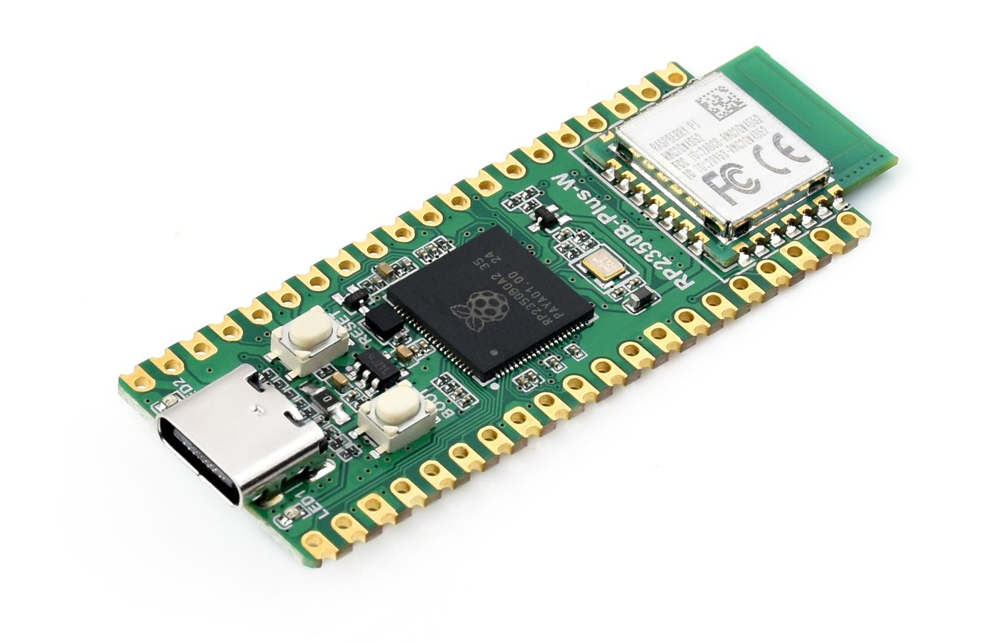
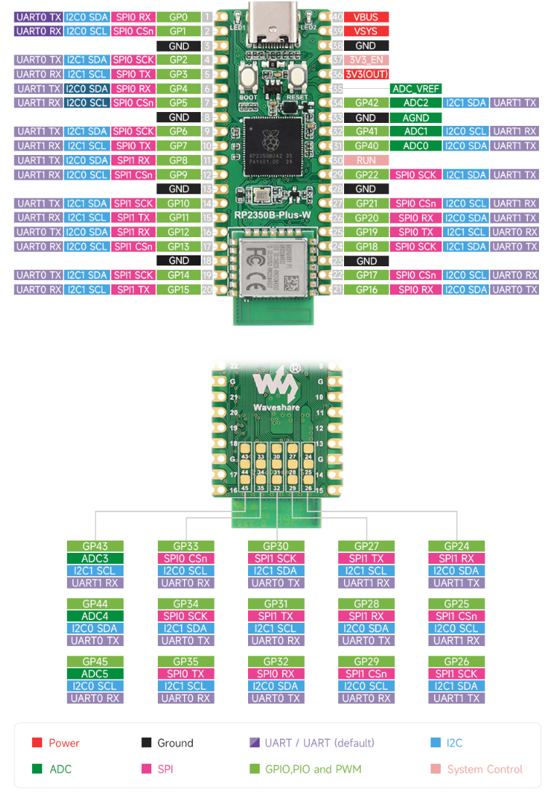

# DS5Dongle for Waveshare RP2350B-Plus-W

<p align="center">
  
</p>

> Fork of [awalol/DS5Dongle](https://github.com/awalol/DS5Dongle) adapted for the
> [**Waveshare RP2350B-Plus-W**](https://www.waveshare.com/rp2350b-plus-w.htm) — an
> RP2350**B** (QFN-80, 48 GPIO) board with the Raspberry Pi Radio Module 2
> (CYW43439, Wi-Fi 4 / BT 5.2) and a **USB Type-C** connector.

The upstream project targets the Raspberry Pi Pico 2 W (RP2350A, micro-USB).
This fork keeps the firmware logic identical and only changes what's needed
to run on the Waveshare board.

## What changed vs. upstream

| Thing | Pico 2 W (upstream) | Waveshare RP2350B-Plus-W (this fork) |
|---|---|---|
| MCU | RP2350**A** (30 GPIO) | RP2350**B** (48 GPIO) |
| USB connector | micro-USB | **USB Type-C** |
| Flash | 4 MB | 16 MB |
| Wireless | CYW43439 on board | CYW43439 on RM2 module |
| `WL_REG_ON` | GPIO 23 | **GPIO 36** |
| `WL_DATA` (DOUT/DIN/IRQ) | GPIO 24 | **GPIO 37** |
| `WL_CS` | GPIO 25 | **GPIO 38** |
| `WL_CLOCK` | GPIO 29 | **GPIO 39** |
| `VSYS` sense | GPIO 29 (shared with WL_CLOCK) | GPIO 46 / ADC6 |
| User LED (firmware) | CYW43 GPIO0 (LED1) | CYW43 GPIO0 (LED1) — unchanged |

<details>
<summary>Pin diagram (click to expand)</summary>

<p align="center">
  
</p>

</details>

Everything is contained in three files:

- `boards/waveshare_rp2350b_plus_w.h` — custom Pico SDK board header
- `CMakeLists.txt` — `WAVESHARE_RP2350B_PLUS_W` build option
- `tools/build-windows.ps1` — `-Board waveshare` flag

No firmware-side `.cpp` was touched — the existing
`CYW43_WL_GPIO_LED_PIN`/`cyw43_arch_gpio_put` code keeps working because LED1
on the Waveshare silkscreen is wired to CYW43 GPIO0, just like on the Pico 2 W.

## Getting the firmware

### Option A — pre-built `.uf2`

Check the **[Releases](../../releases)** of this fork, or the GitHub Actions
artifacts on the `main` branch.

### Option B — build it yourself

#### Windows 11 (one command)

You don't have to clone anything beforehand — just download
[`tools/build-windows.ps1`](tools/build-windows.ps1) and run it in PowerShell:

```powershell
powershell -ExecutionPolicy Bypass -File .\build-windows.ps1 -Board waveshare
```

The script installs every prerequisite (CMake, Ninja, Python, Git, the ARM
GNU toolchain — via `winget`, with portable downloads as fallback), clones
this repo plus the pinned Pico SDK + TinyUSB into `%USERPROFILE%\.ds5-build`,
builds the firmware, and drops `ds5-bridge.uf2` next to the script and on your
Desktop. It is safe to re-run.

Useful flags:

- `-Variant debug` — adds `-DENABLE_SERIAL=ON -DENABLE_VERBOSE=ON` (USB-CDC log)
- `-Variant wake` — adds `-DENABLE_WAKE_HID=ON` (wake-on-PS-button)
- `-Clean` — wipe the variant build dir first
- `-Repo <url> -Ref <branch>` — build a fork or a specific ref

If you already have a checkout, run `tools\build-windows.ps1 -Board waveshare`
from the repo root — it detects and uses your local checkout.

#### Other platforms (manual build)

```bash
git submodule update --init --recursive
cmake -S . -B build -G Ninja \
      -DCMAKE_BUILD_TYPE=Release \
      -DPICO_SDK_PATH=<sdk> \
      -DWAVESHARE_RP2350B_PLUS_W=ON
cmake --build build --target ds5-bridge
```

Requires Pico SDK **2.2.0** with the TinyUSB submodule pinned at tag
**0.20.0** (or newer).

## Flashing

1. Hold **BOOTSEL** on the Waveshare board and plug it in via USB-C.
2. It mounts as a USB drive named `RP2350`.
3. Drag `ds5-bridge.uf2` onto the drive — the board reboots into the firmware.

## Pairing the DualSense

1. Put the DualSense into pairing mode (hold **Create + PS** until the lightbar
   blinks rapidly).
2. Wait for the dongle to detect and connect.
3. Once connected, the controller appears on the host system as a regular
   wired DualSense.

> The dongle is only visible to the OS **after** the controller has connected
> over Bluetooth. You may have to re-plug the dongle while the controller is
> in pairing mode if it doesn't pick up on the first try.

## Features (unchanged from upstream)

- 🎮 Full DualSense connectivity over Bluetooth
- 🔊 HD haptics (advanced vibration feedback)
- 🔉 Speaker passthrough
- 🪫 Low-battery LED indicator (LED1 blinks at 1 Hz when battery ≤ 10 % and
  not charging)

To opt out of the battery-LED feature at build time: configure with
`-DENABLE_BATT_LED=OFF`.

### USB Wake feature (experimental)

Same as upstream — enable with `-Variant wake`. See upstream issues
[#60](https://github.com/awalol/DS5Dongle/issues/60) and
[#61](https://github.com/awalol/DS5Dongle/issues/61) for caveats.

## Web configuration

You can change runtime settings via the upstream-hosted web config:

- Release: https://ds5.awalol.eu.org
- Dev: https://ds5-dev.awalol.eu.org

## Overclock & power

Like upstream, the Waveshare board is run at 320 MHz @ 1.20 V to keep up
with audio encoding. If your board fails to boot, drop the frequency or
nudge the voltage in `CMakeLists.txt` / `src/main.cpp`.

## Known issues

- ⚠️ Audio may experience slight stuttering (inherited from upstream)
- ⚠️ This fork has been validated on the author's single Waveshare board;
  please open an issue if your board behaves differently.

## Staying in sync with upstream

```bash
git remote add upstream https://github.com/awalol/DS5Dongle.git   # once
git fetch upstream
git merge upstream/master   # or rebase
git push
```

## Credits

- [awalol/DS5Dongle](https://github.com/awalol/DS5Dongle) — original project
- [rafaelvaloto/Pico_W-Dualsense](https://github.com/rafaelvaloto/Pico_W-Dualsense) — project inspiration
- [egormanga/SAxense](https://github.com/egormanga/SAxense) — Bluetooth haptics PoC
- [DualSense fandom wiki](https://controllers.fandom.com/wiki/Sony_DualSense) — DualSense report structure
- [Paliverse/DualSenseX](https://github.com/Paliverse/DualSenseX) — speaker report packet
- [earlephilhower/arduino-pico variant `waveshare_rp2350b_plus_w`](https://github.com/earlephilhower/arduino-pico/blob/master/variants/waveshare_rp2350b_plus_w/pins_arduino.h) — reference for the RM2 pin mapping

## License

Same as upstream — see [LICENSE](LICENSE).
